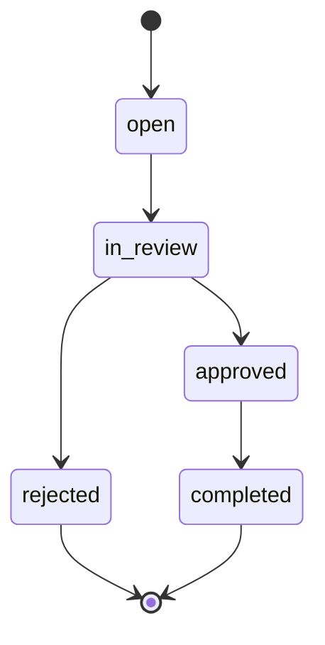

<div align="center">

# 📦 Returnli

**A returns desk for a small online store** — raise a return/replacement request, work it through its lifecycle, leave notes, and close it out.

[](https://returnli.vercel.app)
[](https://returnli-api.onrender.com)


</div>

> [!NOTE]
> The API runs on Render's free tier, which spins down after ~15 min idle — the **first** request after a pause may take 30–60s (cold start), then it's fast.

---

## 🧱 Tech stack

| Layer | Choice |
|---|---|
| **Frontend** | Next.js (App Router) + React, Tailwind CSS, SWR, lucide-react — JavaScript |
| **Backend** | Node.js + Express — JavaScript |
| **Database** | PostgreSQL (Supabase), raw SQL via `pg` (node-postgres) |
| **Validation** | Zod at every API boundary |
| **Hosting** | Vercel (frontend) · Render (backend) · Supabase (Postgres) |

## 📁 Repository structure

```text
returnli/
├─ backend/                 # Express API
│  └─ src/
│     ├─ index.js           # server bootstrap + graceful shutdown
│     ├─ app.js             # middleware, routes, error handler
│     ├─ db/                # pool, schema.sql, migrate, seed
│     ├─ domain/            # business rules (state machine + guards) + tests
│     ├─ schemas/           # Zod request schemas
│     ├─ routes/            # requests, orders, stats
│     └─ lib/               # AppError, error middleware, asyncHandler, validate
└─ frontend/                # Next.js app
   ├─ app/                  # dashboard (/), list, [id] detail, new
   ├─ components/           # Header, StatusBadge, Skeleton
   └─ lib/                  # api fetch wrapper, useDebounce
```

## ⚙️ Local setup (from a clean machine)

> **Prerequisites:** Node.js >= 18, and a PostgreSQL database (local, or a free Supabase/Neon project).

<details open>
<summary><b>1 · Backend</b></summary>

```bash
cd backend
cp .env.example .env          # then set DATABASE_URL (and CORS_ORIGIN)
npm install
npm run migrate               # creates tables, constraints, indexes, sequence
npm run seed                  # 30+ requests across every status & reason, with notes
npm run dev                   # http://localhost:4000
```
</details>

<details open>
<summary><b>2 · Frontend</b></summary>

```bash
cd frontend
cp .env.example .env.local    # set NEXT_PUBLIC_API_BASE_URL=http://localhost:4000
npm install
npm run dev                   # http://localhost:3000
```
</details>

<details>
<summary><b>Tests</b></summary>

```bash
cd backend && npm test        # domain-layer unit tests (state machine + rule guards)
```
</details>

## 🔑 Environment variables

**`backend/.env`**
| Variable | Description |
|---|---|
| `DATABASE_URL` | Postgres connection string (Supabase "Session pooler" URI recommended) |
| `PORT` | Optional; defaults to 4000 (Render sets this automatically) |
| `CORS_ORIGIN` | Allowed frontend origin, e.g. `http://localhost:3000` or the Vercel URL |

**`frontend/.env.local`**
| Variable | Description |
|---|---|
| `NEXT_PUBLIC_API_BASE_URL` | Backend origin — no trailing slash, no `/api` (e.g. `http://localhost:4000`) |

Real `.env` files are gitignored; only `.env.example` templates are committed.

## 📡 API

All responses are JSON. Errors use one consistent envelope:

```json
{ "error": { "code": "INVALID_TRANSITION", "message": "…", "details": {} } }
```

**HTTP semantics:** `400` malformed / invalid shape · `422` semantic violation · `404` not found / removed · `409` state conflict · `201` created · `204` removed.

<details>
<summary><b>Full endpoint reference</b></summary>

| Method | Path | Purpose |
|---|---|---|
| GET | `/health` | Liveness check |
| GET | `/api/stats` | Dashboard metrics (counts, refund total, recent) |
| GET | `/api/orders` | Orders + customer (for the create form) |
| GET | `/api/orders/:reference` | One order with its items |
| GET | `/api/requests` | List: `q`, `status`, `reason`, `sort`, `order`, `page`, `pageSize` — all in SQL |
| POST | `/api/requests` | Raise a request (reference auto-generated) |
| GET | `/api/requests/:idOrRef` | One request with its notes (id or `RTN-` reference) |
| PATCH | `/api/requests/:id` | Edit details (pre-decision only) |
| POST | `/api/requests/:id/transition` | Move status `{ to, resolution?, refundAmount? }` |
| DELETE | `/api/requests/:id` | Soft remove |
| POST | `/api/requests/:id/notes` | Append a note |

</details>

## 📏 Business rules (enforced on the server)



| Rule | Enforcement |
|---|---|
| **1. Status flow** (above); rejected/completed are terminal | App state machine (`domain/status.js`) + `CHECK` on status values |
| **2. Approval needs a resolution**; refund ⇒ amount > 0; non-refund ⇒ no amount | App (`validateApproval`) **and** a DB `CHECK` constraint |
| **3. One live request per (order, item)** | **DB partial unique index**; `23505` mapped to `409` (race-safe) |
| **4. Details locked once decided** | App (`assertEditable`) on PATCH |
| **5. Removal is soft, only open/rejected** | `removed_at` column + `assertRemovable`; reads filter `removed_at IS NULL` |

## 🧠 Key design decisions

- **Raw SQL via `pg`** over an ORM — the brief grades the queries directly; filtering/sorting/paging are hand-written SQL with proper indexes.
- **Two rules enforced in the database** (refund↔resolution `CHECK`, one-live-per-item partial unique index) — correctness holds even if the API is hit directly, and the duplicate check is race-safe (insert-and-catch, not check-then-insert).
- **`CHECK` constraints instead of Postgres enums** — real DB enforcement that's easy to evolve.
- **Reference auto-generated** via a dedicated Postgres sequence + column default — the client never supplies it.
- **Soft delete** — `DELETE` is the correct REST semantic; implemented as `removed_at` to preserve the audit record.
- **Single `/transition` endpoint** with a shared guard — centralizes lifecycle legality (no duplicated validation).
- **Pure domain layer** (no DB/HTTP) — unit-testable in isolation, reused by routes.
- **Frontend** — SWR for fetching; filters live in the **URL** (survive navigation, shareable); debounced search; all loading/empty/error states handled; responsive to 375px with a slide-in mobile drawer.

## ❓ Assumptions (brief was ambiguous)

- **"In Review" is the decision point** — rejection happens from `in_review` (not `open`); it's the only way to ever reject, since `open` can only move to `in_review`.
- **PATCH edits `quantity` and `reason`** — the correctable request details. Changing the underlying order/item is out of scope.
- **Refund amount has no upper cap** — the brief only requires `> 0`.
- **Notes can be added in any non-removed state**, including after a decision.

## ✅ Status

**Done:** full agent desk — dashboard, list (search/filter/sort/paginate), detail with notes + legal-only actions, create form; all five business rules enforced server-side with a consistent error contract; seed script; deployed end-to-end.

**Deferred (deliberately):**
- **Auth** — the brief's core is agent-only without auth; planned as agent login via Passport (`passport-local` + `passport-jwt`).
- **Customer portal** and **media uploads** (photos/videos with compression).
- **Automated API/integration tests** — the domain layer has unit tests; API behaviour was verified manually. `supertest` integration tests are the next step.

## 👤 Author & time

- **Author:** Shubham Kumar
- **Time spent:** ~24 hours
